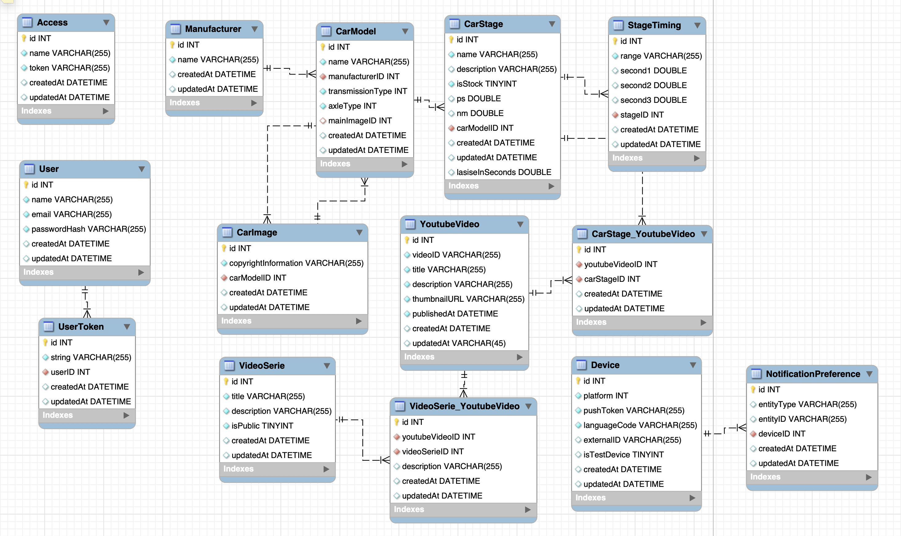

# JP Fan App Server (Swift/Vapor)

## Database Model

### Access

- Basic API Tokens to manage clients which connects to the API

### User

- Administrative Users (No Role Model) which can login and do write actions

### UserToken

- User (Admin) Tokens to use after login ("Authorization" Header)

### Manufacturer

Examples:

- Volkswagen
- Audi
- BMW
- ...

### CarModel

Examples:

- Golf 6 GTI, Automatic, Front, MainImage
- ...

### CarStage

Examples:

- Serie, isStock=true, 211PS, 280NM
- Stage 1, isStock=false, 250PS, 350NM
- ...

### CarStage_YoutubeVideo

- Link between CarStage and Youtube Video
- What CarStage was shown in which YoutubeVideo

CarStage (n) <-> (m) YoutubeVideo
- A YoutubeVideo can contain multiple CarStages
- A CarStage can be shown in multiple YoutubeVideos

Examples:

- Serie, Youtube Video abc
- Stage, Youtube Video xyz
- ...

### StageTiming

Examples:

- Serie, 0-100, 6.1, 6.2, 6.3
- Serie, 100-200, 20
- Stage 1, 0-100, 5.1
- ...

### YoutubeVideo

- Clone of all JP Youtube Videos

### VideoSerie

Examples:

- Frage - Antwort, isPublic=true

### VideoSerie_YoutubeVideo

VideoSerie (n) <-> (m) YoutubeVideo
- A YoutubeVideo can be presented in Multiple VideoSeries
- A VideoSerie contains multiple YoutubeVideos

### Device

Contains information for push services

### NotificationPreference

Settings for Notifications

EntityTypes:
- Video
- CarModel

EntityID: Can be null or the ID of a Video or CarModel

Reason:
Users can subscribe to ALL CarModel Notifications or to explicit CarModels